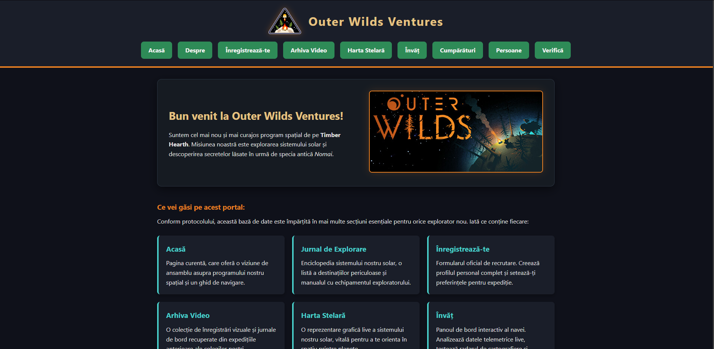
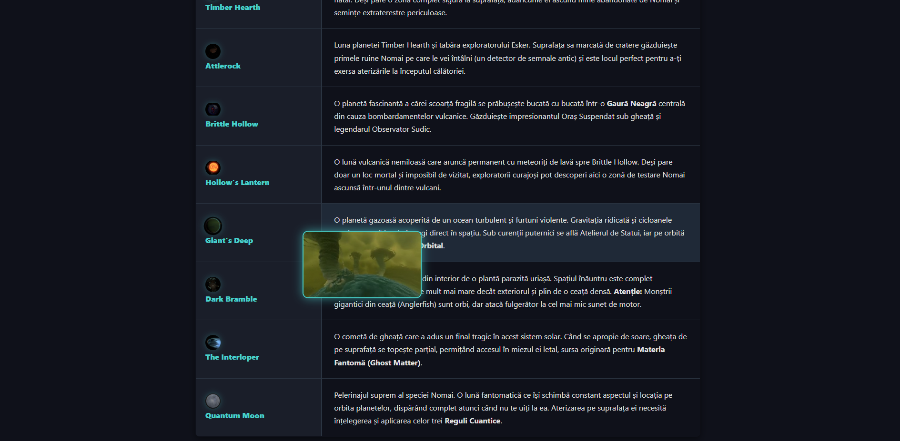
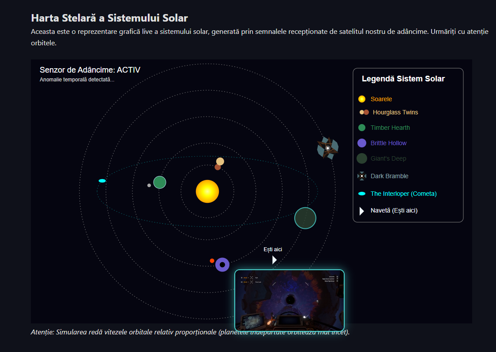
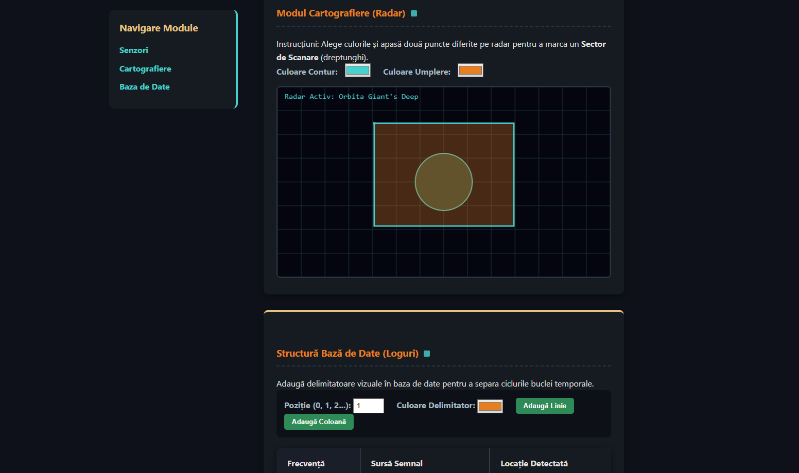
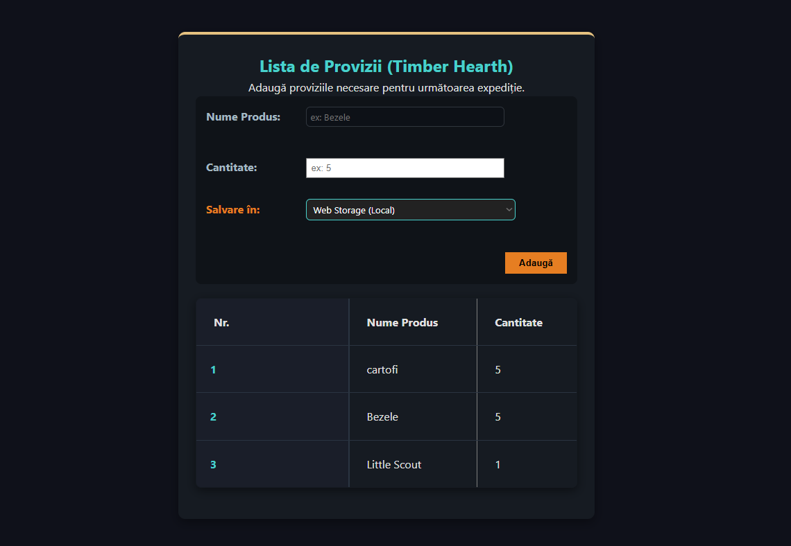
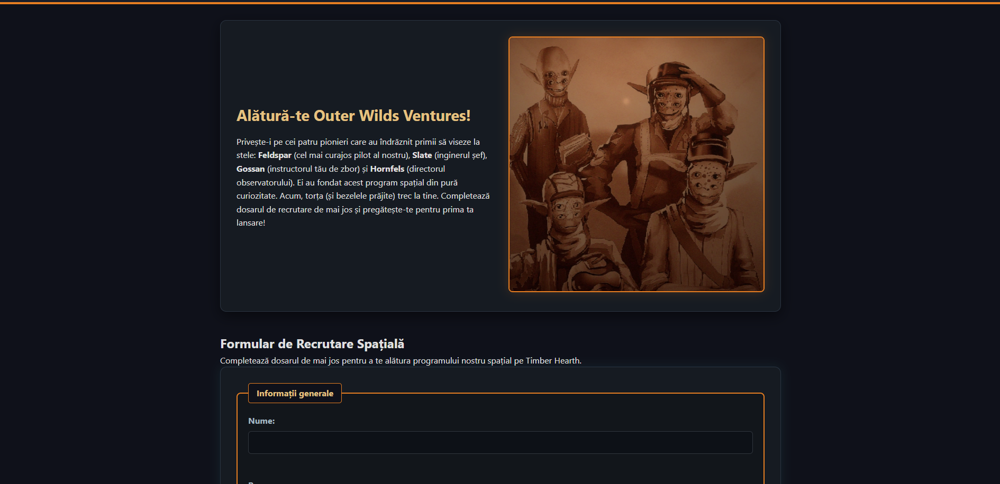
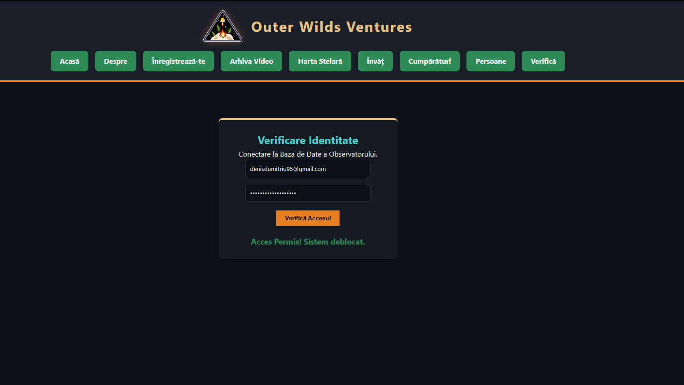
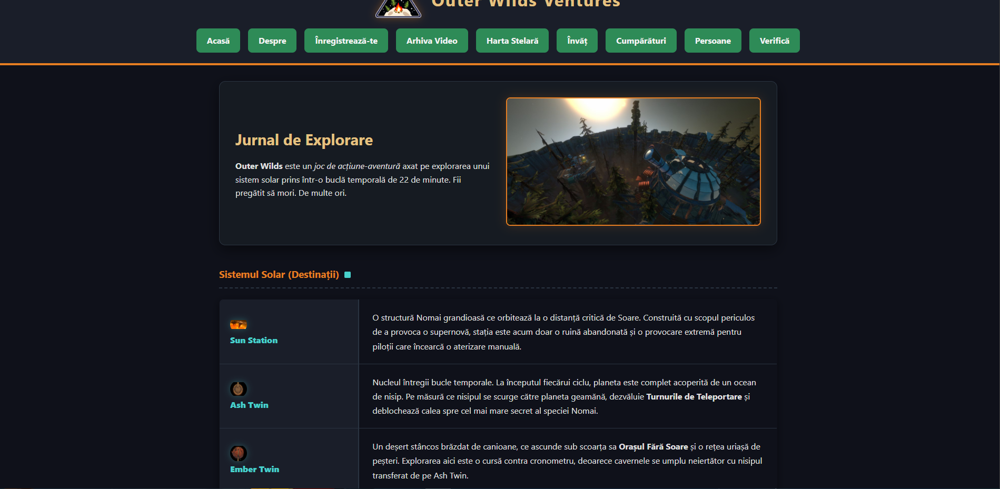
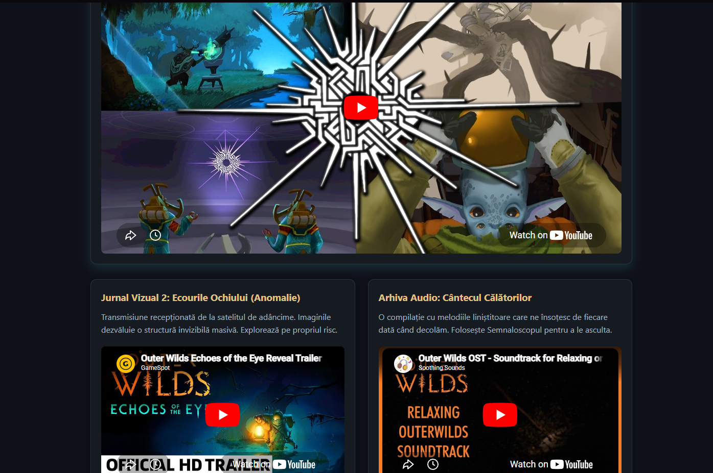

# 🚀 Outer Wilds Ventures - Web Portal



> **Proiect realizat pentru disciplina Programare Web.**
> **Profesor coordonator:** Bărbuța Delia
> O aplicație web completă de tip **SPA (Single Page Application)** construită de la zero, având un frontend modern (Vanilla HTML/CSS/JS) și un backend custom (Server Python multi-threaded).

**🌍 [Live Demo (Doar interfața Frontend)](https://outer-wilds-website.vercel.app/)**

---

## 📖 Despre Proiect

Acest portal interactiv servește drept bază de date și panou de control pentru programul spațial *Outer Wilds Ventures*. Utilizatorii pot explora sistemul solar, viziona arhive video, adăuga provizii folosind baze de date in-browser și se pot înregistra în programul spațial printr-un sistem securizat conectat la un server Python custom.

Proiectul nu folosește niciun framework extern (fără React, Angular sau Express), demonstrând o înțelegere profundă a tehnologiilor web fundamentale.

---

## 📸 Galerie Foto (Funcționalități)

### 1. Navigare SPA & Jurnal de Explorare
Navigare rapidă fără reîncărcarea paginii. Funcție interactivă de *Hover Preview* care declanșează videoclipuri explicative deasupra fiecărei planete.


### 2. Harta Stelară (SVG Animată)
O reprezentare grafică complexă a sistemului solar, creată exclusiv din cod `<svg>` (utilizând elemente precum `rect`, `circle`, `ellipse`, `path`, `polygon`).


### 3. Panoul "Învăț" (Canvas & API-uri Browser)
Sistem de cartografiere interactiv desenat în `<canvas>`, completat de citirea datelor telemetrice live (Geolocație, Navigator, Ceas în timp real) și manipularea dinamică a tabelelor.


### 4. Gestiunea Proviziilor (OOP, IndexedDB & Web Workers)
Un sistem de stocare avansat scris în JavaScript Orientat pe Obiecte (Clase/Interfețe). Permite comutarea live între `LocalStorage` și `IndexedDB`. Adăugarea produselor este procesată în fundal folosind un **Web Worker**.


### 5. Formular de Înregistrare & Validare
Formular HTML5 complex cu validare client-side și server-side. Butonul de submit este protejat de o bifă pentru Termeni și Condiții. Datele sunt trimise prin **AJAX (Fetch API)**.


### 6. Autentificare & Bază de Date
Sistem de login ce interoghează baza de date (`utilizatori.json`). Serverul Python previne conturile duplicate (returnând codul `409 Conflict`).


### 7. Prezentare & Arhivă Video
Integrare iFrame YouTube și pagini de prezentare cu design responsiv folosind CSS Flexbox.



---

## 🛠️ Tehnologii Utilizate

### 🖥️ Frontend
*   **HTML5:** Structură semantică, formulare complexe, `<video>`, `<audio>`, `<canvas>`, `<svg>`.
*   **CSS3:** Design responsiv (Mobile, Tablet, Desktop, **Print**), Flexbox, CSS Grid, Pseudo-clase (`:hover`, `:nth-child`, `:disabled`) și Pseudo-elemente (`::before`, `::after`), `@media queries`.
*   **JavaScript (Vanilla / ES6+):**
    *   Arhitectură **Single Page Application (SPA)** folosind `fetch` pentru a injecta HTML.
    *   Programare Orientată pe Obiecte (OOP) cu Clase.
    *   Manipulare DOM avansată.
    *   **Promisiuni (Promises) & Async/Await**.
    *   **Web Workers** pentru procesare multi-threading în browser.
    *   **LocalStorage** și **IndexedDB** pentru persistența datelor.
    *   API-uri de browser (Geolocation).

### ⚙️ Backend (Server Custom Python)
*   **Sockets (`socket`):** Server HTTP construit de la zero, fără librării framework.
*   **Multithreading (`concurrent.futures.ThreadPoolExecutor`):** Poate deservi până la 50 de utilizatori simultan.
*   **GZIP Compression:** Arhivează automat resursele `.html`, `.css` și `.js` pentru a optimiza traficul pe rețea.
*   **JSON Database:** Procesează cereri `POST`, citește/scrie în `utilizatori.json` și gestionează erori de rețea (Returnează statusuri HTTP corecte: `200 OK`, `404 Not Found`, `409 Conflict`, `500 Server Error`).

---

## ⚙️ Cum să rulezi proiectul local

Deoarece proiectul are propriul său server web în spate, nu poate fi deschis simplu dând dublu-click pe `index.html` (datorită politicilor CORS și necesității API-ului de baze de date). 

Urmează acești pași pentru a-l rula:

1. Asigură-te că ai **Python 3** instalat pe calculator.
2. Deschide un terminal (Command Prompt / PowerShell / Bash).
3. Navighează în folderul proiectului, apoi în folderul serverului:
```
cd calea/catre/Outer-Wilds-Website/server
```

4. Pornește serverul Python:
```
python server_web.py
```

5. Deschide browserul preferat și accesează adresa:
```
http://localhost:5678
```

---

## 📂 Structura Proiectului

```
📦 Outer-Wilds-Website
 ┣ 📂 continut               # Frontend-ul aplicației (SPA)
 ┃ ┣ 📂 css                  # Fişiere de stilizare (stil.css)
 ┃ ┣ 📂 imagini              # Resurse grafice şi screenshots
 ┃ ┣ 📂 js                   # Logica client-side (script.js, cumparaturi.js, worker.js)
 ┃ ┣ 📂 resurse              # Baza de date (utilizatori.json)
 ┃ ┣ 📂 video                # Fişiere MP4 pentru previzualizări
 ┃ ┣ 📜 index.html           # Pagina principală (Containerul SPA)
 ┃ ┗ 📜 *.html               # Părţile aplicaţiei (acasa, despre, invat, etc.)
 ┗ 📂 server                 # Backend-ul aplicaţiei
   ┗ 📜 server_web.py        # Serverul HTTP Custom scris în Python
```

---
*Ne vedem pe Timber Hearth! 🌲🔥🏕️*
