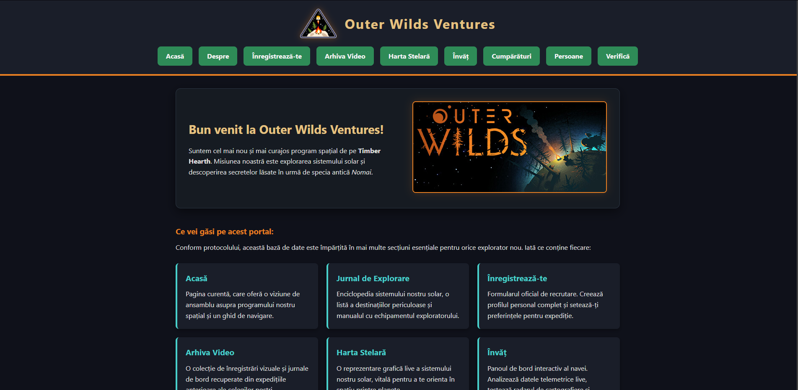
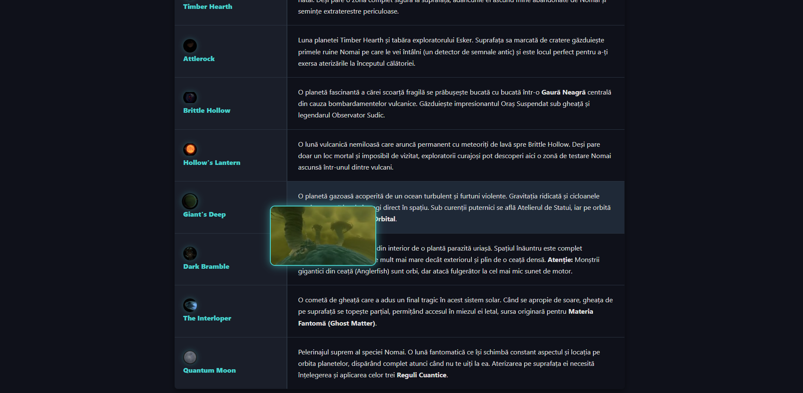
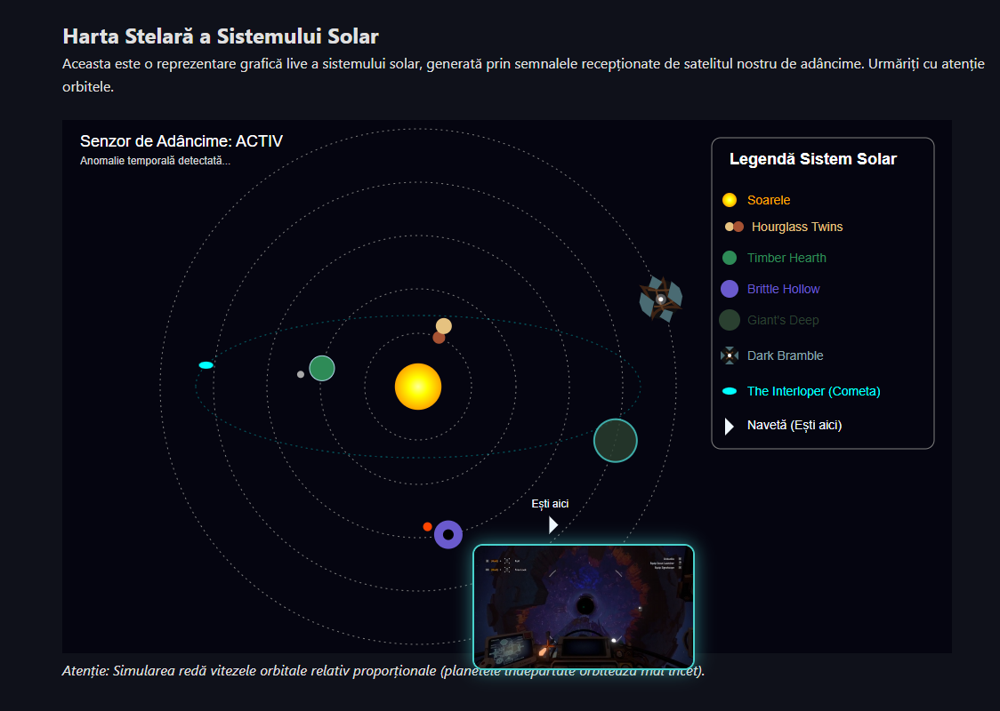
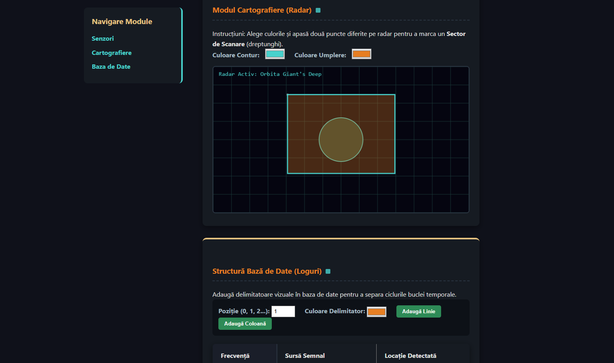
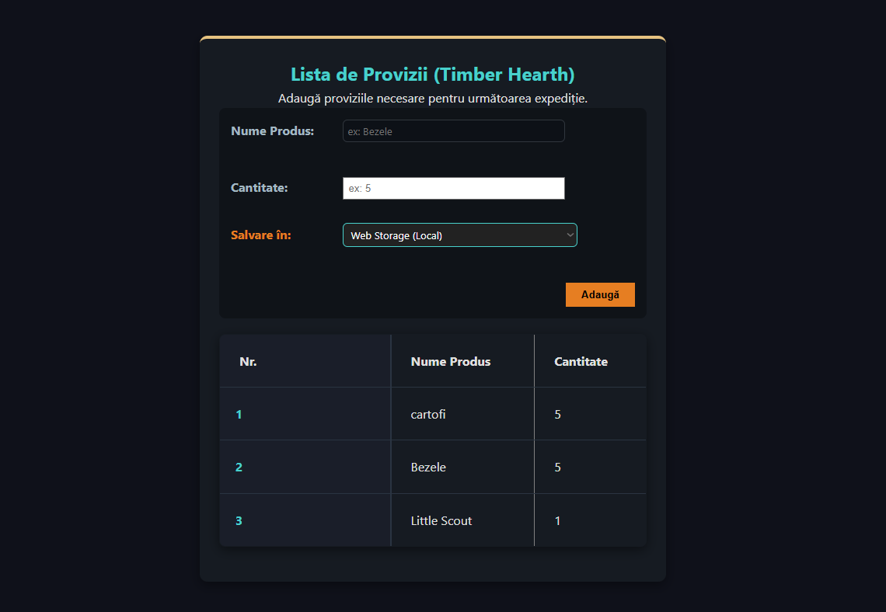
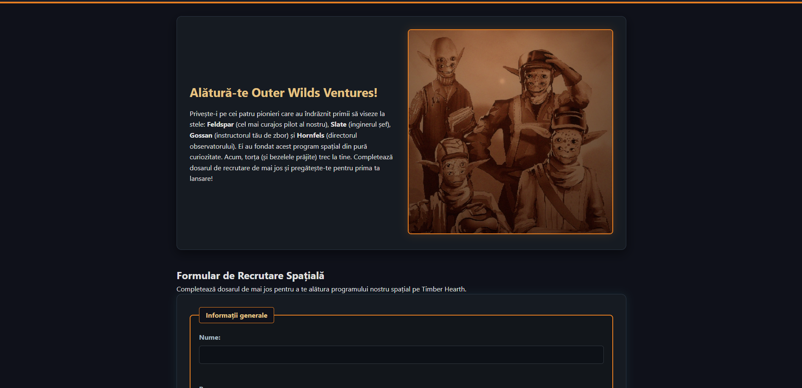
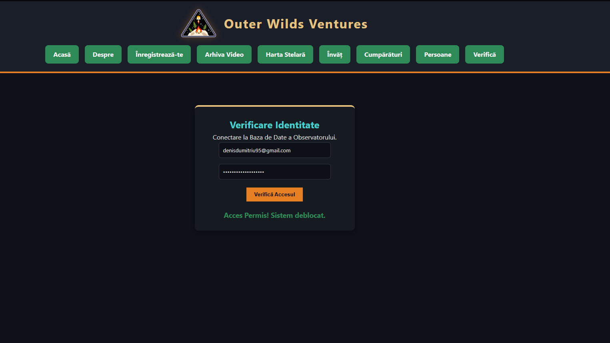
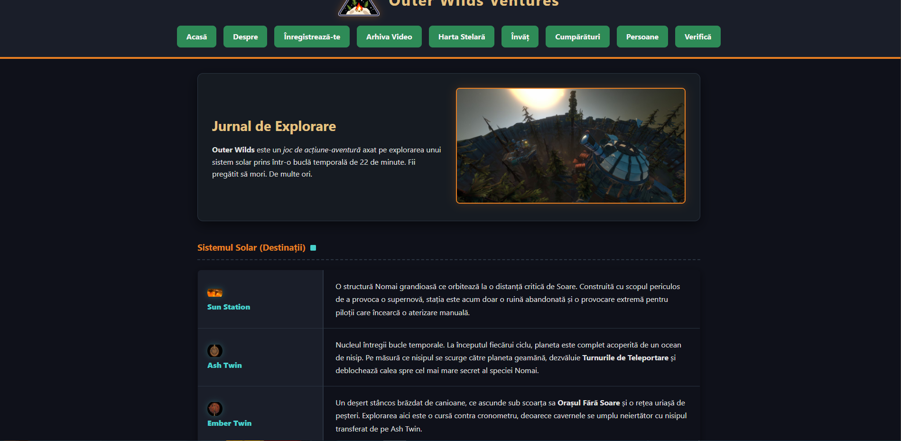
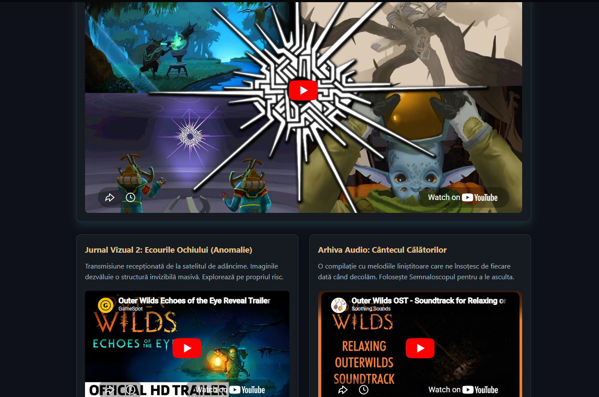

# 🚀 Outer Wilds Ventures - Web Portal



> 🎓 **Project created for the course:** Web Programming
> 👩‍🏫 **Supervising Professor:** Bărbuța Delia
>
> 🛠️ *A complete **SPA (Single Page Application)** web app built from scratch, featuring a modern frontend (Vanilla HTML/CSS/JS) and a custom backend (Multi-threaded Python Server).*

**🌍 [Live Demo](https://outer-wilds-website.vercel.app/)**

---

## 📖 About the Project

This interactive portal serves as a database and control panel for the *Outer Wilds Ventures* space program. Users can explore the solar system, watch video archives, add supplies using in-browser databases, and register for the space program through a secure system connected to a custom Python server.

The project uses no external frameworks (no React, Angular, or Express), demonstrating a deep understanding of fundamental web technologies.

---

## 📸 Screenshot Gallery (Features)

### 1. SPA Navigation & Exploration Journal

Fast navigation without page reloads. An interactive *Hover Preview* feature that triggers explanatory videos above each planet.



### 2. Star Map (Animated SVG)

A complex graphical representation of the solar system, created entirely from `<svg>` code (using elements such as `rect`, `circle`, `ellipse`, `path`, `polygon`).



### 3. "Learn" Panel (Canvas & Browser APIs)

An interactive cartography system drawn in `<canvas>`, supplemented by live telemetric data reading (Geolocation, Navigator, Real-time Clock) and dynamic table manipulation.



### 4. Supplies Management (OOP, IndexedDB & Web Workers)

An advanced storage system written in Object-Oriented JavaScript (Classes/Interfaces). Supports live switching between `LocalStorage` and `IndexedDB`. Product additions are processed in the background using a **Web Worker**.



### 5. Registration Form & Validation

A complex HTML5 form with client-side and server-side validation. The submit button is guarded by a Terms and Conditions checkbox. Data is sent via **AJAX (Fetch API)**.



### 6. Authentication & Database

A login system that queries the database (`utilizatori.json`). The Python server prevents duplicate accounts (returning `409 Conflict`).



### 7. Presentation & Video Archive

YouTube iFrame integration and presentation pages with responsive design using CSS Flexbox.





---

## 🛠️ Technologies Used

### 🖥️ Frontend

*   **HTML5:** Semantic structure, complex forms, `<video>`, `<audio>`, `<canvas>`, `<svg>`.
*   **CSS3:** Responsive design (Mobile, Tablet, Desktop, **Print**), Flexbox, CSS Grid, Pseudo-classes (`:hover`, `:nth-child`, `:disabled`) and Pseudo-elements (`::before`, `::after`), `@media queries`.
*   **JavaScript (Vanilla / ES6+):**
    *   **Single Page Application (SPA)** architecture using `fetch` to inject HTML.
    *   Object-Oriented Programming (OOP) with Classes.
    *   Advanced DOM manipulation.
    *   **Promises & Async/Await**.
    *   **Web Workers** for multi-threaded processing in the browser.
    *   **LocalStorage** and **IndexedDB** for data persistence.
    *   Browser APIs (Geolocation).

### ⚙️ Backend (Custom Python Server)

*   **Sockets (`socket`):** HTTP server built from scratch, without any framework libraries.
*   **Multithreading (`concurrent.futures.ThreadPoolExecutor`):** Can serve up to 50 simultaneous users.
*   **GZIP Compression:** Automatically compresses `.html`, `.css`, and `.js` resources to optimize network traffic.
*   **JSON Database:** Processes `POST` requests, reads/writes to `utilizatori.json`, and handles network errors (Returns correct HTTP statuses: `200 OK`, `404 Not Found`, `409 Conflict`, `500 Server Error`).

---

## ⚙️ How to Run the Project Locally

Because the project has its own web server, it cannot be opened simply by double-clicking `index.html` (due to CORS policies and the need for the database API).

Follow these steps to run it:

1. Make sure you have **Python 3** installed on your machine.
2. Open a terminal (Command Prompt / PowerShell / Bash).
3. Navigate to the project folder, then into the server folder:
```
cd path/to/Outer-Wilds-Website/server
```
4. Start the Python server:
```
python server_web.py
```
5. Open your preferred browser and go to:
```
http://localhost:5678
```

---

## 📂 Project Structure

```
📦 Outer-Wilds-Website
 ┣ 📂 continut               # Application frontend (SPA)
 ┃ ┣ 📂 css                  # Stylesheet files (stil.css)
 ┃ ┣ 📂 imagini              # Graphic resources and screenshots
 ┃ ┣ 📂 js                   # Client-side logic (script.js, cumparaturi.js, worker.js)
 ┃ ┣ 📂 resurse              # Database (utilizatori.json)
 ┃ ┣ 📂 video                # MP4 files for previews
 ┃ ┣ 📜 index.html           # Main page (SPA Container)
 ┃ ┗ 📜 *.html               # Application sections (home, about, learn, etc.)
 ┗ 📂 server                 # Application backend
   ┗ 📜 server_web.py        # Custom HTTP Server written in Python
```

---
